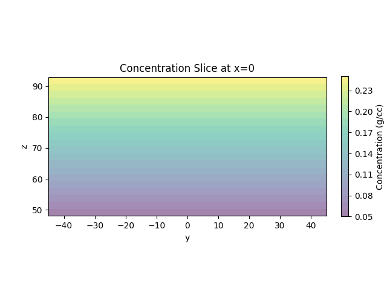
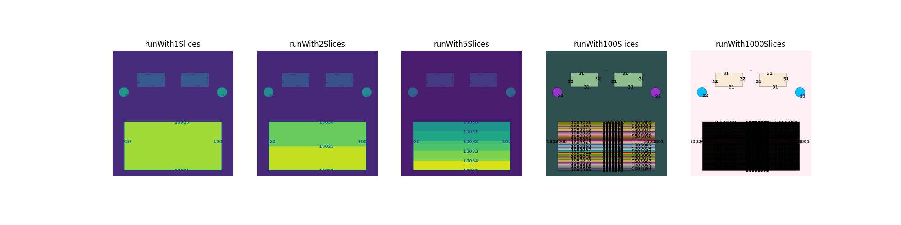
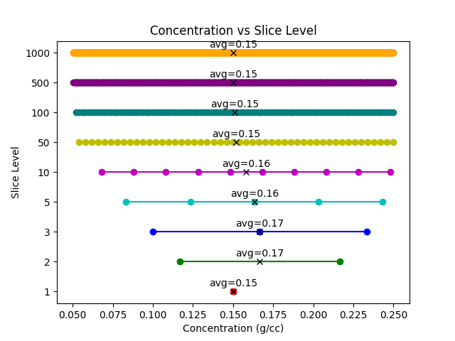
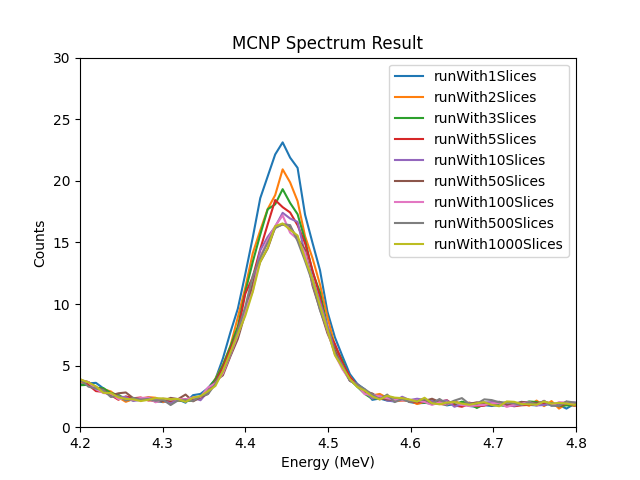
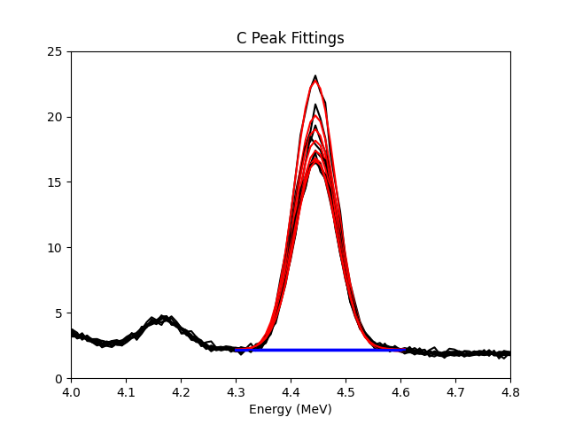
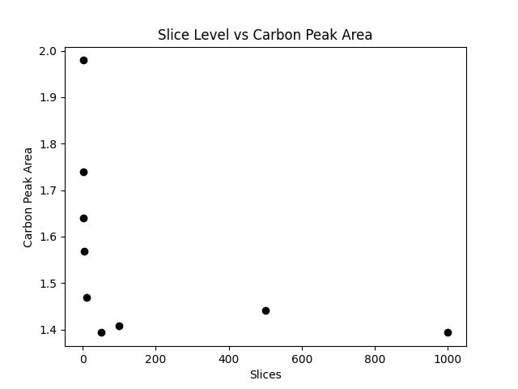

# Winter Progress Report - Jose Cortes

# Introduction
This report will provide an overview of the progress made during the winter of 2024-2025. The report will cover the following topics:

- Functional material to mcnp code and testing
- Previous and Upcoming Presentations
- Future Work

# Functional material to mcnp code and testing
The functional material to mcnp code and testing was completed. The technique and code can be used to approximate varied soil compositions for simulations.
This is done so in a "cutting" method, where an mcnp geometry is divided into sections, enabling the definition of "varied" chemical compositions.

The following figures demonstrate the testing done:

First I decribe a block of soil matching the dimensions of the soil in the most recent MINS architecture. 
I apply a function that describes the weight percentage of carbon in the soil. 
The function is a linear function of the depth of the soil. The function is as follows:

$$
f(z) =
\begin{cases} 
    C_0 + \frac{(C_1 - C_0)(z - z_0)}{z_1 - z_0}, & \text{for } z_0 \leq z \leq z_1, \\
    C_0, & \text{for } z \leq z_0, \\
    C_1, & \text{for } z \geq z_1.
\end{cases}
$$

with the following parameters:

- $C_0 = 0.05$
- $C_1 = 0.25$
- $z_0 = 48$
- $z_1 = 48+45$

Here is a visual of the carbon content in the soil:

The remaining elemental content is defined by a ratio:

$$
\begin{align*}
    \text{Nitrogen} &= 0.44 \times (1-\text{Carbon}) \\
    \text{Oxygen} &= 0.55 \times (1-\text{Carbon}) \\
    \text{Hydrogen} &= 0.01 \times (1-\text{Carbon})
\end{align*}
$$

The soil is separated into n sections, each with a different carbon content. Sampling the midpoint of each section, the materials are defined in MCNP. The following figures show the MCNP input geometry:

The input code for this can be located in atlas at /project/auburn-mins/andres/expirements/compute/soil_in_sections2 .

The materials carbon content at each slice level is shown in the following figure:

The MCNP code was run and the results are shown in the following figure:

Peak Fitting was done:

On a graph, the peak areas vs sections are shown as follows:

# Previous and Upcoming Presentations

In the Fall I gave a poster presentation on the MINS project at a UTA conference "mathposium". 
The poster was well received and I was able to answer questions about the work.
The poster is attached to the email as this report.

here is a picture of me presenting the poster:

In the spring i hope to present at the missouri state conference on agriculture and ai. 
There is a speaker and poster option, I am writing the abstract for the speaker option. 
Please let me know what you think of this. 

# Future Work

- Whole Field Simulation for comparison with cylinder harvest method
- Using the cutting method to generate f4 mesh in soil